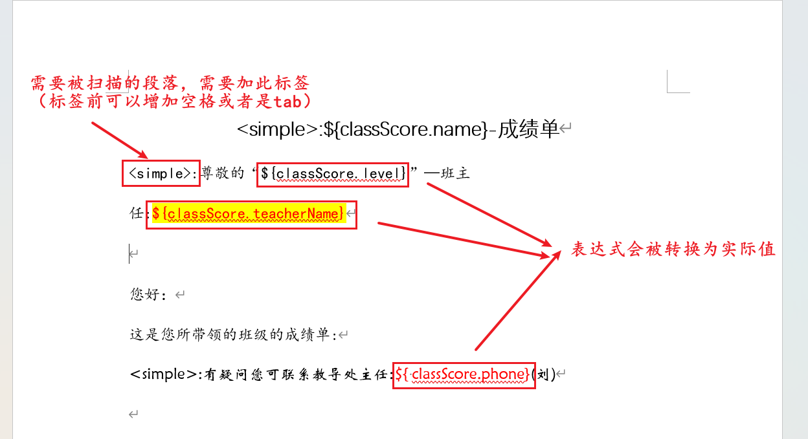
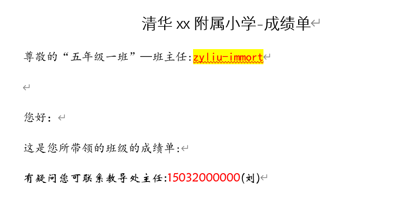
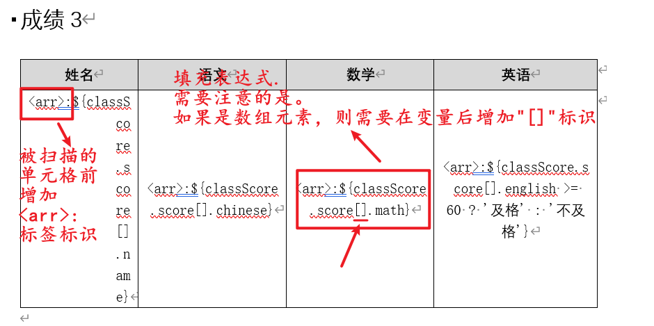
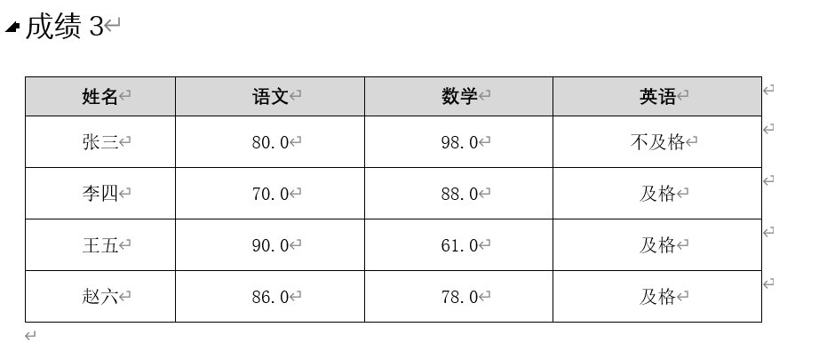
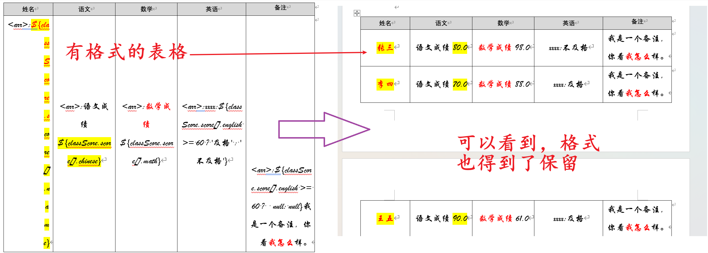
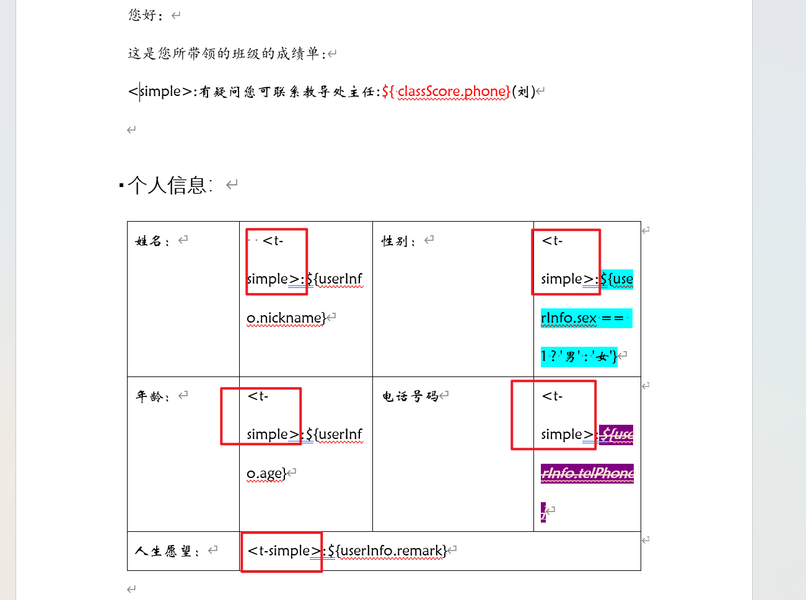
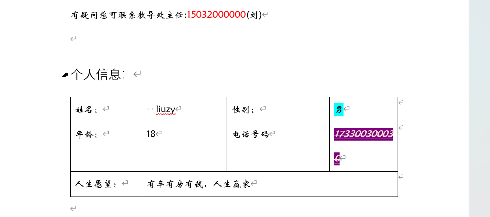
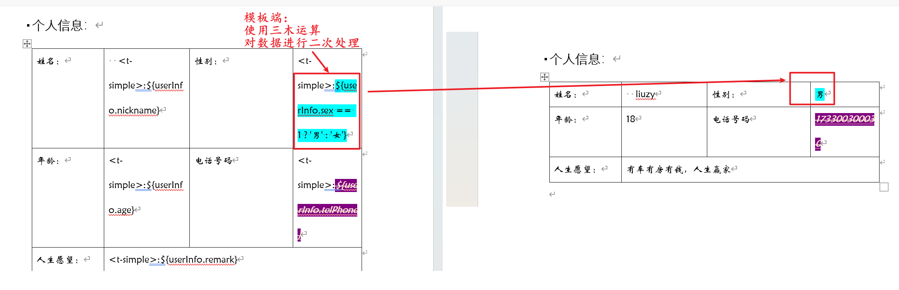
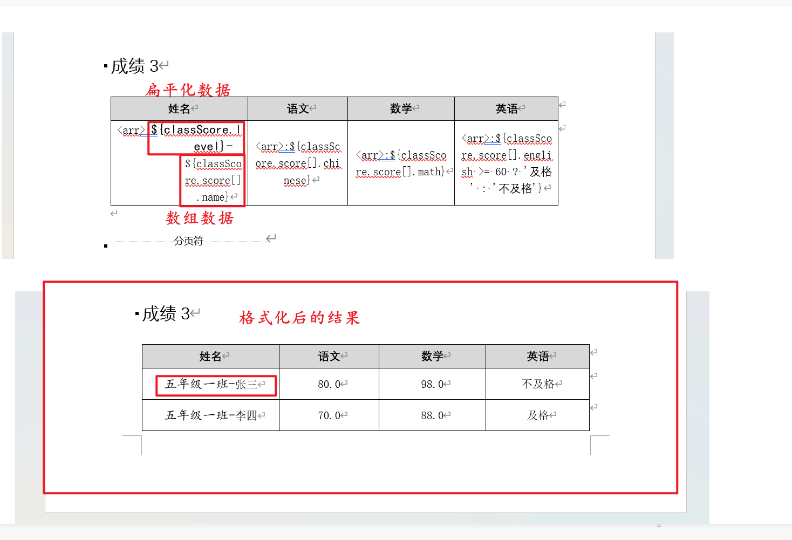
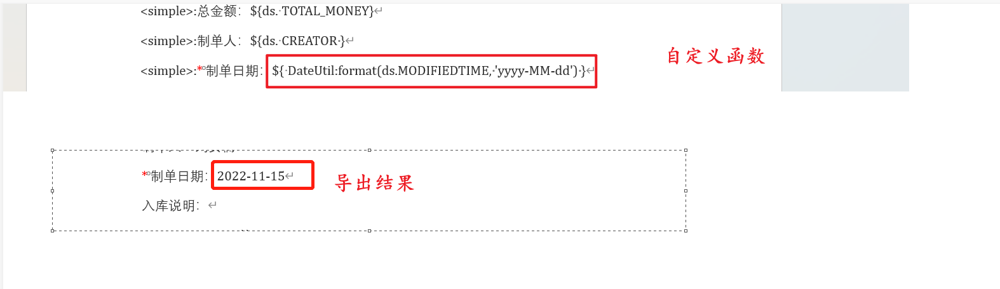

## 项目简介

### 1.1 基本介绍

- 本项目是基于POI框架编写的Word数据填充工具；
- 基于模板填充数据，操作简单，容易理解，容易上手。


### 1.2 特点与亮点

> 这节看不懂？没关系，其实我也看不懂，哈哈。
>
> 直接看第2节即可。


- 模板填充

  只需要在模板中定义表达式，再将数据传给框架，框架会根据表达式的内容与模板公式自动填充数据。

  您的模板可以来自任何地方，如：文件服务器、OSS、本地文件等等。本框架并不关心您的模板从哪里获取。

  您的数据也可以来自任何地方，如：远程调用获取、数据库获取、本地计算产生等。本框架同样不关心您的数据从何种地方获取。

  您只需要提供**document**和**数据**即可。


- 模板表达式丰富

  模板中的表达式支持对数据的 **加减乘除，三目运算**操作，支持**自定义函数**操作(在构建引擎时加入自定义的函数，即可再模板中进行指向，程序会**自动调用**)。实现了数据的多变性，数据与模板的解耦。


- 支持简单、**数组**、**树形结构（Word暂时不支持）**的填充。
- 填充格式保留：填充后尽量保持原样式。


- 支持扩展

  如果框架提供的标签不够满足您的使用要求，您还可以进行扩展，而不用更改任何代码。

## 2. 基本功能演示

> 此测试用例在项目中可查看。

### 2.1 段落中填充

1. 在需要**被扫描**的段落前**增加标签**`<simple>:`

2. 在段落中添加表达式。

   

3. 系统会**扫描**带有 `<simple>:` 标签的段落，并将表达式替换为实际值。

4. 填充结果如下：

   

5. 上述填充所用的数据如下：

> 为了方便查看，这里使用JSON格式展示；实际数据结构可以为：Map、POJO-Object

```json
{
     "classScore":{
        "level":"五年级一班",
        "name":"清华xx附属小学",
        "phone":"15032000000",
        "teacherName":"zyliu-immort"
    }
}
```


### 2.2 表格arr填充

1. 在需要**被扫描**的单元格最前方**增加标签**`<arr>:`

2. 在单元格中添加表达式。

   

3. 系统会**扫描**带有 `<arr>:` 标签的单元格，并将表达式替换为实际值。

4. 填充结果如下：

   

5. 上述填充所用的数据如下：

> 为了方便查看，这里使用JSON格式展示；实际数据结构可以为：Map、POJO-Object

```json
{
    "classScore":{
        // score为 列表 变量，所以在填充时，此变量后要加"[]"标识
        "score":[
            {
                "chinese":80,
                "english":30,
                "math":98,
                "name":"张三"
            },
            {
                "chinese":70,
                "english":88,
                "math":88,
                "name":"李四"
            },
            {
                "chinese":90,
                "english":90,
                "math":61,
                "name":"王五"
            },
            {
                "chinese":86,
                "english":78,
                "math":78,
                "name":"赵六"
            }
        ],
        "level":"五年级一班",
        "name":"清华xx附属小学",
        "phone":"15032000000"
    }
}
```

6. 填充时，格式也会被保留，如图所示：

   

### 2.3 表格simple填充

1. 在需要**被扫描**的单元格最前方**增加标签**`<t-simple>:`

   

2. 在单元格中添加表达式。

3. 系统会**扫描**带有 `<t-simple>:` 标签的单元格，并将表达式替换为实际值。

4. 填充结果如下:

   

5. 上述填充所用的数据如下：

> 为了方便查看，这里使用JSON格式展示；实际数据结构可以为：Map、POJO-Object

```json
{
    "userInfo":{
        "address":"中国北京市海淀区",
        "age":18,
        "nickname":"liuzy",
        "remark":"有车有房有钱，人生赢家",
        "sex":1,
        "telPhone":"173300300030"
    }
}
```


### 2.4 表达式计算

> 支持简单的运算，例如：加、减、乘、除、三目运算等。
>
> 如果想使用复杂的运算，请使用`自定义函数` （详情可以看2.6节）

图中以三目运算符为例：



### 2.5 混合填充

> 数组填充时，也可以添加非数组元素表达式



### 2.6 自定义函数

> 使用自定义函数的前提要使用本框架时 进行注册（注册方式详情可参考第4节）。
>
> 如不注册，则模板端无函数可用。



## 3. 项目详细使用


## 4. 项目扩展


## 5.联系我

- `email`:  **zyliu99@foxmail.com**


## 6. 开源协议

[Apache 2.0](./LICENSE) © immort-zyliu

